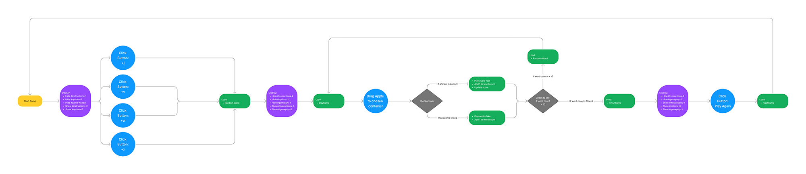

# Bobbing Apples

---

## About

Bobbing Apples is a basic web based JavaScript game. A game designed to help with the support and development for teaching and learning phonics to children in early years. The game adopts a simple approach with an appealing colour scheme that will allow for the ideal user experience for a young target audience.

The targeted audience will initially be that of a teacher or parent that will use this as a resource for aiding and supporting the learning experience for teaching children to identify real words. Once the adult has chosen the word group that they require, then the intended audience target will change to that of a child of early years age 4-5 who will then proceed to play the game.

The intended user's will benefit greatly from such a game. From a teacher's perspective they gain a new resource which they can share with there class. Having multiple resources with different styles of gameplay greatly enhances the learning experience and support that a teacher can offer there children. For the child they will benefit from having more variety in terms of the games that they can play. Bobbing Apples gives them the benefits of an easy style of play, that will give them the core basic learning of being able to identify what words are real or fake.

***Click **[here](https://davewhiteh.github.io/bobbing-apples/)** to view the live website.***

---

## User Experiences (UX)

### **User Stories**

**As a potential teacher/parent user:**

+ I want to clearly identify the instructions on how to play the game
+ I want to be able to choose between all the different word groups that are intended for phonics phase 3 set 6
+ I want the game to be simple and engaging so that the game instructions can be explained easily to young children
+ I want the game to be short due to the attention span of the attended audience
+ I want the option to be able to play again after each game has ended

**As a potential 4-5 year old user:**

+ I want to learn the new phonics words that have been chosen
+ I want the game to be quick and simple to play
+ I want to clearly be made aware if an answer was correct or incorrect
+ I want to see what score was achieved at the end of the game

**As the site owner:**

+ I want to create an interactive game that will aide with the teaching of phonics to children
+ I want the game to be fun and engaging with an appealing display with the use of bright bold colours
+ I want to give the user the opportunity to provide feedback about the game
+ I want to provide a unique game for teachers so that they have access to even more variety for the aide in teaching phonics

### **Strategy**

**Site Goals**

This project is to come up with an interactive experience to users by firstly designing and then creating a web based game using HTML, CSS and Javascript.

The main goals of the game are to provide teachers/parents with a resource that can help them when teaching phonics phase 3 set 6 to 4 and 5 year olds and also importantly to help those children progress by giving them the opportunity to learn new words in a fun and engaging experience.

The game must be easy to navigate and easy for a child to play so that they don't become bored or overwhelmed due to complexity. It must be appealing with the use of easy identifiable objects and bright bold colours. The game should be fully responsive and be playable on all modern devices.

### **Scope**

The main features for the game are to include an easy to follow navigation with a bright colour scheme that will appeal to the younger audience. It will feature an interactive layout that will give the user fun factor whilst also providing an all important learning experience.

**Start**

This is the first part of the game where the user will be informed of how to play the game and will provide them with a button that will start the game. There will also feature an animated bobbing apples object which will clearly show the link between the title and the overall theme of the game. At the footer of the screen will be where the user can contact the developer via a modal form. Next to this link will be an icon of GitHub that will allow the user to go to the developers GitHub repository page.

**Options**

The options layout will keep the same layout as the first but instead of a central start button, the user will be presented with four new buttons to select. They will also have clear and easy to read text that clearly states which phase and set of phonics this game targets. The option buttons will allow the user to select which word groups they would like to play with.

**Gameplay**

The layout for the actual game will change completely. The score for the user to see will be featured at the top right of the page. The object in the centre of the page will have an animated single bobbing apple that will contain the word that the user will read. Depending on the display there will be another two separate objects either underneath or on the side that will be where the user will drag the apple to, depending on whether they believe the answer is correct or wrong. The user at any given time will be able to go back to the main menu where they can choose a different word group. This will be accessible via a button on the top left of the screen.

**Final Score**

The last layout will revert back to the first two layouts (Start & Options) in keeping with an easy design layout, however, the top section text will contain the final score that the user managed to achieve. The middle button will allow the user to play the game again.

### **Structure**

The structure of the game will consist of four basic layouts that the user will navigate through via a selection of buttons and interactive gameplay. These layouts will be changed using javascript so that the experience is kept smooth and fluid throughout, rather than having four separate html pages. The layouts will be kept simple and minimalistic so that the young individuals playing the game will never feel overwhelmed when playing the game.

The structure of each layout will consist of three parts. The top which will hold the instructions. These instructions will provide an explanation of what is required from the user at any given time through the different layouts. There will be a middle where the user will be provided with the options. These options allow the user to navigate through the game. Lastly the bottom which will generally consist of both the animated and interactive objects for both visual aspects and the actual gameplay. There will also consist of a footer that will contain links to both a feedback form and a link to GitHub.

### **Skeleton**

To create the wireframes for the game a tool called Figma was used. This is an excellent tool that allows for a much more professional creation of not only the wireframes but also a full designed aspect of the game, providing the layouts and using the colours and images. Each set of frames was used to represent the three main devices, mobile, tablet and desktop, adopting a mobile first approach. Having the full design layout created is a huge benefit for when it is time to create the game using the respected languages, it makes it easier to visualise how and where everything fits together. Good preparation is impeccable to the success of any project!

Mobile (360 x 640) 
Tablet (1024 x 1366) 
Desktop (1920 x 1080)

Wireframes

Design Layout

Figjam (A tool within Figma) was used to create the two flowcharts. One that looks at the base overview of the actual game and the other that shows the basic logic of how the game works. This is an extremely important step that will help understand, how the user will interact and play the game.

Flowchart - Overview

Flowchart - Basic Logic

### **Surface**

**Colour**

The base colours were chosen within Figma. Initially the background colours were chosen first which essentially represents a basic sky and grass theme. This was generated using the site [angrytools.com](https://angrytools.com/gradient/) to create the linear-gradient. Due to the main theme of the game being about red apples, both the blue (#293ACF) and the yellow (#FFFF00) were chosen as they were big, bold and bright colours that really set off against the background. These being the prime colours will help keeps things familiar to the young users.

Tints and shades of these colours were found at [maketintsandshade.com](https://maketintsandshades.com/#293ACF,FFFF00).

**Typography**

Initially to begin with the font Mulish was found using google and was chosen because of its simplistic look. More importantly the font uses the proper English 'a'. This was an important reason because the younger user needed to be looking at the words with the correctly spelt English Language, if not this could lead to confusion causing a bad experience within the game.
The font Mulish was then used to pair with another font that would be used for the heading of the game. This is where the font Philosopher was chosen using a site called [fontpair.co](https://www.fontpair.co/pairings/philosopher-mulish). Both these fonts are available at [Google Fonts](https://fonts.google.com/).

**Images**

The images were chosen carefully as they needed to be easily identifiable by the user. They required a simple look, this is why vectors were chosen. The vectors easily represent the theme of the game in terms of how the game is played in real life. Using a bucket of water with apples and either a bin or basket to put the apples in once they have been picked from the water. All the sources where the vectors came from can be found within the [credits](#credits) section.

**Icons**

Only one icon to be used which was from [Font Awesome](https://fontawesome.com/). The GitHub icon which will contain a link to my repository should the user want to see more work that has been developed.