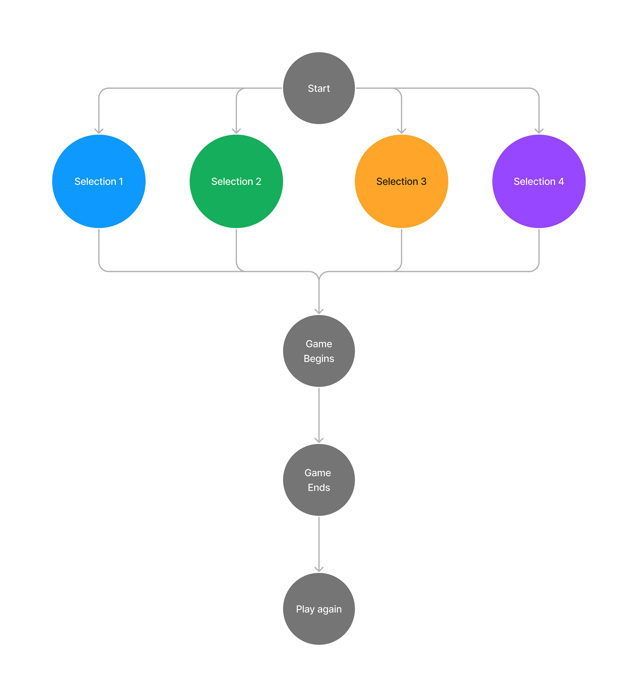
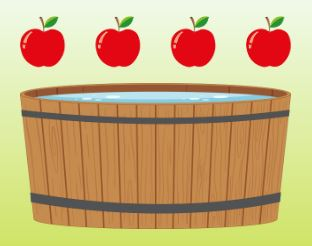

# Bobbing Apples

---

## Table of Contents

1. [About](#about)
2. [User Experiences (UX)](#user-experiences-ux)
    + [User Stories](#user-stories)
    + [Strategy](#strategy)
    + [Scope](#scope)
    + [Structure](#structure)
    + [Skeleton](#skeleton)
    + [Surface](#surface)
3. [Features](#features)
    + [Main Header](#main-header)
    + [Instructions](#instructions)
    + [Buttons](#buttons)
    + [Current Score](#current-score)
    + [Final Score](#final-score)
    + [Barrel and Apple(s) Image](#barrel-and-apples-image)
    + [In-game Containers](#in-game-containers)
    + [Contact the Developer](#contact-the-developer)
4. [Future Features](#future-features)
5. [Technologies Used](#technologies-used)
    + [Languages](#languages)
    + [Frameworks & Libraries](#frameworks--libraries)
    + [Programs](#programs)
    + [Websites](#websites)
6. [Testing](#testing)
    + [Testing User Stories](#testing-user-stories)
    + [Validation](#validation)
    + [Responsiveness](#responsiveness)
    + [Browser Compatibility](#browser-compatibility)
    + [Performance](#performance)
    + [Bugs and Fixes](#bugs-and-fixes)
7. [Deployment](#deployment)
    + [GitHub Pages](#github-pages)
    + [Forking the GitHub Repository](#forking-the-github-repository)
    + [Cloning the GitHub Repository](#cloning-the-github-repository)
8. [Credits](#credits)
    + [Media](#media)
    + [Sound](#sound)
9. [Acknowledgements](#acknowledgements)

---

## About

Bobbing Apples is a basic web based JavaScript game. A game designed to help with the support and development for teaching and learning phonics to children in early years. The game adopts a simple approach with an appealing colour scheme that will allow for the ideal user experience for a young target audience.

The targeted audience will initially be that of a teacher or parent that will use this as a resource for aiding and supporting the learning experience for teaching children to identify real words. Once the adult has chosen the word group that they require, then the intended audience target will change to that of a child of early years age 4-5 who will then proceed to play the game.

The intended user's will benefit greatly from such a game. From a teacher's perspective they gain a new resource which they can share with there class. Having multiple resources with different styles of gameplay greatly enhances the learning experience and support that a teacher can offer there children. For the child they will benefit from having more variety in terms of the games that they can play. Bobbing Apples gives them the benefits of an easy style of play, that will give them the core basic learning of being able to identify what words are real or fake.

***Click **[here](https://davewhiteh.github.io/bobbing-apples/)** to view the live website.***

---

## User Experiences (UX)

### **User Stories**

**As a potential teacher/parent user:**

+ I want to clearly identify the instructions on how to play the game
+ I want to be able to choose between all the different word groups that are intended for phonics phase 3 set 6
+ I want the game to be simple and engaging so that the game instructions can be explained easily to young children
+ I want the game to be short due to the attention span of the attended audience
+ I want the option to be able to play again after each game has ended

**As a potential 4-5 year old user:**

+ I want to learn the new phonics words that have been chosen
+ I want the game to be quick and simple to play
+ I want to clearly be made aware if an answer was correct or incorrect
+ I want to see what score was achieved at the end of the game

**As the site owner:**

+ I want to create an interactive game that will aide with the teaching of phonics to children
+ I want the game to be fun and engaging with an appealing display with the use of bright bold colours
+ I want to give the user the opportunity to provide feedback about the game
+ I want to provide a unique game for teachers so that they have access to even more variety for the aide in teaching phonics

### **Strategy**

**Site Goals**

This project is to come up with an interactive experience to users by firstly designing and then creating a web based game using HTML, CSS and Javascript.

The main goals of the game are to provide teachers/parents with a resource that can help them when teaching phonics phase 3 set 6 to 4 and 5 year olds and also importantly to help those children progress by giving them the opportunity to learn new words in a fun and engaging experience.

The game must be easy to navigate and easy for a child to play so that they don't become bored or overwhelmed due to complexity. It must be appealing with the use of easy identifiable objects and bright bold colours. The game should be fully responsive and be playable on all modern devices.

### **Scope**

The main features for the game are to include an easy to follow navigation with a bright colour scheme that will appeal to the younger audience. It will feature an interactive layout that will give the user fun factor whilst also providing an all important learning experience.

**Start**

This is the first part of the game where the user will be informed of how to play the game and will provide them with a button that will start the game. There will also feature an animated bobbing apples object which will clearly show the link between the title and the overall theme of the game. At the footer of the screen will be where the user can contact the developer via a modal form. Next to this link will be an icon of GitHub that will allow the user to go to the developers GitHub repository page.

**Options**

The options layout will keep the same layout as the first but instead of a central start button, the user will be presented with four new buttons to select. They will also have clear and easy to read text that clearly states which phase and set of phonics this game targets. The option buttons will allow the user to select which word groups they would like to play with.

**Gameplay**

The layout for the actual game will change completely. The score for the user to see will be featured at the top right of the page. The object in the centre of the page will have an animated single bobbing apple that will contain the word that the user will read. Depending on the display there will be another two separate objects either underneath or on the side that will be where the user will drag the apple to, depending on whether they believe the answer is correct or wrong. The user at any given time will be able to go back to the main menu where they can choose a different word group. This will be accessible via a button on the top left of the screen.

**Final Score**

The last layout will revert back to the first two layouts (Start & Options) in keeping with an easy design layout, however, the top section text will contain the final score that the user managed to achieve. The middle button will allow the user to play the game again.

### **Structure**

The structure of the game will consist of four basic layouts that the user will navigate through via a selection of buttons and interactive gameplay. These layouts will be changed using javascript so that the experience is kept smooth and fluid throughout, rather than having four separate html pages. The layouts will be kept simple and minimalistic so that the young individuals playing the game will never feel overwhelmed when playing the game.

The structure of each layout will consist of three parts. The top which will hold the instructions. These instructions will provide an explanation of what is required from the user at any given time through the different layouts. There will be a middle where the user will be provided with the options. These options allow the user to navigate through the game. Lastly the bottom which will generally consist of both the animated and interactive objects for both visual aspects and the actual gameplay. There will also consist of a footer that will contain links to both a feedback form and a link to GitHub.

### **Skeleton**

To create the wireframes for the game a tool called Figma was used. This is an excellent tool that allows for a much more professional creation of not only the wireframes but also a full designed aspect of the game, providing the layouts and using the colours and images. Each set of frames was used to represent the three main devices, mobile, tablet and desktop, adopting a mobile first approach. Having the full design layout created is a huge benefit for when it is time to create the game using the respected languages, it makes it easier to visualise how and where everything fits together. Good preparation is impeccable to the success of any project!

Mobile (360 x 640) 
Tablet (1024 x 1366) 
Desktop (1920 x 1080)

Wireframes

Design Layout

Figjam (A tool within Figma) was used to create the two flowcharts. One that looks at the base overview of the actual game and the other that shows the basic logic of how the game works. This is an extremely important step that will help understand, how the user will interact and play the game.

Flowchart - Overview

Flowchart - Basic Logic

### **Surface**

**Colour**

The base colours were chosen within Figma. Initially the background colours were chosen first which essentially represents a basic sky and grass theme. This was generated using the site [angrytools.com](https://angrytools.com/gradient/) to create the linear-gradient. Due to the main theme of the game being about red apples, both the blue (#293ACF) and the yellow (#FFFF00) were chosen as they were big, bold and bright colours that really set off against the background. These being the prime colours will help keeps things familiar to the young users.

Tints and shades of these colours were found at [maketintsandshade.com](https://maketintsandshades.com/#293ACF,FFFF00).

**Typography**

Initially to begin with the font Mulish was found using google and was chosen because of its simplistic look. More importantly the font uses the proper English 'a'. This was an important reason because the younger user needed to be looking at the words with the correctly spelt English Language, if not this could lead to confusion causing a bad experience within the game.
The font Mulish was then used to pair with another font that would be used for the heading of the game. This is where the font Philosopher was chosen using a site called [fontpair.co](https://www.fontpair.co/pairings/philosopher-mulish). Both these fonts are available at [Google Fonts](https://fonts.google.com/).

**Images**

The images were chosen carefully as they needed to be easily identifiable by the user. They required a simple look, this is why vectors were chosen. The vectors easily represent the theme of the game in terms of how the game is played in real life. Using a bucket of water with apples and either a bin or basket to put the apples in once they have been picked from the water. All the sources where the vectors came from can be found within the [credits](#credits) section.

**Icons**

Only one icon to be used which was from [Font Awesome](https://fontawesome.com/). The GitHub icon which will contain a link to my repository should the user want to see more work that has been developed.

---

## Features

### **Main Header**

Screenshots

+ The header only features on the start page and is bold and prominent using the games prime colour blue which works well against the light background. The user will easily be able to identify the name of the game.

### **Instructions**

Screenshots

+ The instructions can be found at the top of the page, again utilising the primary blue colour, setting the tone for consistency and using the font mulish that is easily readable for both sets of users. The main user at this point will be that of an older user who will clearly be able to understand the instructions and easily be able to explain this to their younger audience.

### **Buttons**

Screenshots

+ The buttons throughout the game are mainly bright and bold, using the colour yellow to make them stand out on each page. They are generally central on each page, allowing them to be the main focus. This is with the exception of the menu button which is found on the actual in game page on the top left. This uses a darker blue so that this gives off a duller tone. This has been done so that the focus remains on the all important gameplay of the red apple.

### **Current Score**

Screenshots

+ The score can be found on the in game page that features on the top right of the screen. The wording is white so that it is subtle yet readable, where as the actual score is the dark blue used the same as the menu button. This allows for it to stand out but not so that it is over powering on screen.

### **Final Score**

Screenshots

+ Once the game has ended, and the play again page has loaded, the final score can be found towards the top of the screen. It is clear, big and bold allowing the user to see exactly what score they got.

### **Barrel and apple(s) image**

Screenshots

+ The barrel and the apple(s) is generally the main feature on every different layout throughout the game. It clearly shows the connection between the title of the game and the gameplay itself. The apples are animated giving the all important bobbing effect and on the in game page the single bobbing apple holds the all important word that the user must identify with being either real or fake. The single apple in game not only is animated but it also is draggable allowing the user to drag the apple to the relevant container.

### **In-game containers**

Screenshots

+ These containers are where the user will drag the apple to either the real container or fake container. The images are easily identifiable with the real container being a basket of apples, which relates to an individual picking good apples and placing them into a basket. On the other side there is an image of a rubbish bin which represents where an individual would put the bad apples, in this case the fake words. To make sure that this is definitely clear for the user they both have the words real and fake next to them.

### **Contact the developer**

Screenshots

+ At the footer of each layout will be simple text and a github icon that links to the developers github page. The text 'Contact the Developer' will link to a modal that pops up, allowing the user to send feedback about suggestions and improvements about the game.

---

## Future Features

+ To include a 404 page that allows for better user experience. Should something go wrong with a broken link, then it would be better for the user to be sent to a page that has the identifiable branding of the game with a link that gets them back to the start.

+ To include an extra layout within the game that comes after the start. This layout will show more options allowing the user to choose different phonics phases, giving the user's a more variety of options.

+ To include more sets within the game, this coincides with the adding of the phases. Currently the game only offers phase 3 set 6. There are actually multiple sets within phase 3, so having more phases will also mean more sets.

---

## Technologies Used

### **Languages**

+ [HTML5](https://en.wikipedia.org/wiki/HTML5)
+ [CSS3](https://en.wikipedia.org/wiki/CSS)
+ [Javascript](https://en.wikipedia.org/wiki/JavaScript)

### **Frameworks & Libraries**

+ [jQuery](https://jquery.com/)
    + used to create the logic and interaction for the game.
+ [jQuery UI](https://jqueryui.com/)
    + used to create the draggable and droppable features in the game.
+ [jQuery UI Touch Punch](https://cdnjs.com/libraries/jqueryui-touch-punch)
    + used to enable touch events on mobile and tablet devices.
+ [Bootstrap 5.2](https://getbootstrap.com/docs/5.2/getting-started/introduction/)
    + used to create the structure and layout of the website, making it responsive on all devices.
+ [Google Fonts](https://fonts.google.com/)
    + used to get the links to the fonts that are put in the head of the html pages. These fonts are then used throughout the game.
+ [Font Awesome](https://fontawesome.com/)
    + this was used to add icons to the project.
+ [Git](https://git-scm.com/)
    + was used for version control in order to add, commit and push from GitPod to GitHub.
+ [GitHub](https://github.com/)
    + is used as a repository and to host the full project.
+ [GitPod](https://www.gitpod.io/)
    + is the IDE that is used to develop the game.

### **Programs**

+ [Adobe Illustrator](https://www.adobe.com/uk/products/illustrator.html)
    + illustrator is used to alter the vectors that were used through the game.
+ [Adobe Photoshop](https://www.adobe.com/uk/products/photoshop.html)
    + is used to alter and resize all the images that are used within the project.

### **Websites**

+ [Free Sound](https://freesound.org)
    + this site was used to source the sounds used within the game.
+ [Vecteezy](https://www.vecteezy.com/)
    + this site was used to source the vectors used within the game.
+ [Free Pik](https://www.freepik.com)
    + this site was used to source the vectors used within the game.
+ [Convertio](https://convertio.co/)
    + this site was used to convert the images from png to webp.
+ [Fontpair](https://www.fontpair.co/)
    + this site was used to pair the two main fonts that are used throughout the game.
+ [Make Tints and Shades](https://maketintsandshades.com/)
    + used to create the tints from the main colour palette for use on the game.
+ [Figma](https://www.figma.com/)
    + used to create the wireframes and design layout for the project.
+ [Favicon](https://favicon.io/)
    + used to create the favicon for the game pages tab.
+ [Am I Responsive?](https://ui.dev/amiresponsive)
    + used to create the responsive mock-up image that is at the beginning of the readme file.
+ [Chrome DevTools](https://developer.chrome.com/docs/devtools/)
    + this was used throughout the whole project, from creating the site, testing the responsiveness of the site and then testing the performance.
+ [W3C CSS Validation Service](https://jigsaw.w3.org/css-validator/)
    + this site is used to validate the css which was used to style the game.
+ [W3C HTML Validation Service](https://validator.w3.org/)
    + used to validate the html for the project.
+ [W3Schools](https://www.w3schools.com/)
    + this site was used as a reference site for learning purposes.
+ [Stack Overflow](https://stackoverflow.com/)
    + was used for seeking out answers and general learning purposes.

---

## Testing

### **Testing User Stories**

**As a potential teacher/parent user:**

**I want to clearly identify the instructions on how to play the game**

Screenshots

+ When the game is first loaded just underneath the main header the user will immediately see the instructions that are clear and concise.

**I want to be able to choose between all the different sounds that are intended for phonics phase 3 set 6**

Screenshots

+ After the user presses start they are then given four buttons. These buttons represent the four sounds that are in phase 3 set 6 for phonics. They are bright and central allowing the user to easily identify with what they must do to choose the sound they would like to play.

**I want the game to be simple and engaging so that the game instructions can be explained easily to young children**

Screenshots

+ The game from the very outset shouts out simple, yet engaging, with the use of bright primary colours and easy to read fonts. The instructions are easy to follow so that the teacher/parent can easily explain to there younger audience on how to play the game. The minimilistic gameplay means the actual in game layout has a simplistic style, making sure that the screen is not busy so that the younger user can easily play the game without being overwhelmed or distracted at any point during gameplay.

**I want the game to be short due to the attention span of the attended audience**

Screenshots

+ From the beginning to the end of the game is setup to be easy to follow for all users. From starting the game, choosing the options, the actual gameplay and the play again screen, all layouts have been setup to navigate through with very few clicks required. The gameplay itself has been kept to a 10 questions maximum in order to keep things short and quick.

**I want the option to be able to play again after each game has ended**

Screenshots

+ Once the game has ended the user is presented with a different layout showing them a centralised button that allows the user to click 'play again' to go back to the start of the game. From a parent/teacher perspective this allows for them to quickly setup a new game for another user and keeps all interactiveness on screen, meaning they won't need to refresh the actual web page which would adopt a poor user experience.

**As a potential 4-5 year old user:**

**I want to learn the new phonics words that have been chosen**

Screenshots

+ When the younger user plays the game they will immediately see the red floating apple in the middle of the screen. This apple contains the random word that the user must identify with being either a real word or fake.

**I want the game to be quick and simple to play**

Screenshots

+ The game play has been created to make sure that not only is it simple to follow with an easy draggable design but also quick. Due to the younger audience having a short attention span, the words have been limited to 10 for this reason.

**I want to clearly be made aware if an answer was correct or incorrect**

Screenshots

<audio src="assets/sounds/real.mp3" controls title="Correct Sound"></audio>

<audio src="assets/sounds/fake.mp3" controls title="Wrong Sound"></audio>

+ This has been approached in two ways. The user will be able to see that they got the answer right or wrong by the score that is kept on the in-game screen. The other is the sound that is played once the user drops the apple onto the chosen container. If they have chosen correctly then they will be played the real sound and if they got the answer wrong they will be played the fake sound.

**I want to see what score was achieved at the end of the game**

Screenshots

+ Once the user finishes the game they will be presented with a new layout that will show them, in big and bold, the score that they got.

**As the site owner:**

**I want to create an interactive game that will aide with the teaching of phonics to children**

Screenshots

+ The game created is definitely interactive. Offering the user to engage at each point throughout the game, whether that is clicking buttons to navigate or dragging and dropping elements to get a response. The game has been kept simple but importantly allows both sets of users to benefit from learning new sounds and to help aide the teaching of phonics.

**I want the game to be fun and engaging with an appealing display with the use of bright bold colours**

Screenshots

+ The game has been setup with a simplistic design, with subtle but affective animations and an interative approach with the dragging and dropping feature. All these features add to the fun side of playing the game. Having the look of the game take a bold approach with the use of primary colours and easy worded instructions also enhances the engagement of the game.

**I want to give the user the opportunity to provide feedback about the game**

Screenshots

+ At the footer of the game there is the 'Contact the developer' link which when clicked will open a modal in the middle of the page. This allows the user to send feedback or even suggestions about how the game could be improved, or any bugs that they may encounter.

**I want to provide a unique game for teachers so that they have access to even more variety of unique games to help teach phonics**

Screenshots

+ After doing the initial research before creating the game, it was easy to realise that even though there were drag and drop games for phonics that existed, there was not one that had the bobbing apples design. This was certainly one of the main reasons for this particular design as it needed to be unique. The game overall gives teachers/parents even more access to resources with a unique style, that can help them with the teaching of phonics.

### **Validation**

**HTML**

HTML Test - 1st Test

The HTML was tested using the validation site W3C HTML Validation Service. There was one error and four warnings. To resolve the error the ***href="#modal-contact"*** was removed from the button as highlighted. Also removed the ***type="text/javascript"*** from the emailJS script and then amended the section elements to divs.

HTML Test - 2nd Test

The HTML was tested a second time through the validation site W3C HTML Validation Service, and this time round, no errors were found.

**CSS**

CSS Test

The validation site W3C CSS Validation Service was used to validate the CSS. No errors were found.

**Javascript**

CSS Test

The validation site jsHint was used to validate the Javascript. No errors were found.

### **Responsiveness**

**Live**

The game was tested on the following live devices:
+ **iiyama desktop monitor - 1920x1080 resolution**
    + the game performed well on a desktop, running smoothly throughout.
+ **Google Pixel 5**
    + the game was tested thoroughly on this mobile device. The game is smooth and responsive throughout on both orientations. There was an issue early on whereby when dragging the apple to one of the containers it was quite sluggish (for details please click [here](#gameplay---sluggish-when-dragging-apple)).
+ **Google Pixel 6a**
    + this mobile device was used to test by a different user. They commented on how easy the game was to play and how visually it looks great that would definitely appeal to a younger audience.
+ **Amazon Fire Tablet HD**
    + the game was tested on this tablet and worked very well. Very responsive, looked good in both orientations and was smooth thoughout.
+ **iPhone 11**
    + playing the game on an iphone worked well. Good visuals and simple to understand and play. There is an issue regarding the sound on the iphone. It did not play the real or fake sounds when required (for details please click [here](#no-sound-on-iphone)).

**Simulation**

The game was also tested using Chrome Developer Tools on the following setups:
+ iPhone SE
+ iPhone XR
+ iPhone 12 Pro
+ Pixel 5
+ Samsung Galaxy S8+
+ Samsung Galazy S20 Ultra
+ Galaxy Fold
+ Samsung Galaxy A51/71
+ iPad Air
+ iPad Mini
+ Surface Pro 7
+ Surface Duo
+ Nest Hub
+ Nest Hub Max

The site performed as expected and was responsive, with all functionality and navigation working well. The surface duo was the only one device that was slightly off the mark in terms of visually, however it was still playable and navigated well.

### **Browser Compatibility**

The game was tested on the following browsers:

+ Google Chrome
+ Mozilla Firefox

On these two browsers the game performed well, no issues were noticed.

### **Performance**

The game was put through a performance test using Google Chrome Developer Tools Lighthouse test.

**Desktop**

Desktop Test - 1st Attempt

The game performed well in the Lighthouse test for the desktop.

**Mobile**

Mobile Test - 2nd Attempt

The game performance dipped slightly for mobile device on the first test. The score for performance was only 86. To get a better performance for mobile the jQuery CDN script was changed to a minified version. This helped raise the performance quite a bit on the second test.

### **Bugs and Fixes**

#### **Gameplay - sluggish when dragging apple**

This was an issue picked up in early testing.

***Issue/Feature*** - When the apple in-game was dragged it was quite sluggish.

Code Before

***Resolution*** - Removed the snap event in the draggable section of the playGame function. The apple when dragged has now resulted in a very smooth draggable experience.

Code After

#### **No sound on iphone**

This issue was noticed when testing the game on both an iphone and ipad.

***Issue/Feature*** - This issue has occurred because ios have blocked autoplay for audio.

***Resolution*** - A soltuion was found by doing some reasearch and coming across different articles that all pointed to relatively the same solution which is a bit of a hack. The audio requires pre loading which must come from a click event. I followed a solution from stack overflow which can be found [here](https://stackoverflow.com/questions/48405744/play-audio-on-drag-and-drop-in-mobile-browsers). The changes to the code that were made, can be found [here](https://github.com/DaveWhiteh/bobbing-apples/commit/83c304382263e178f75edbd447bf2f241784cc89).

---

## Deployment

### **GitHub Pages**

GitHub pages was used to deploy the site.

The steps to deploy the live site are:

+ In the GitHub repository navigate to the 'Settings' tab
+ On the left hand menu click on 'Pages'
+ Under Build and Deployment > Branch select 'main' and '/root'
+ Click save
+ The link to the live website will then be displayed at the top when successfully published

### **Forking the GitHub Repository**

+ Go to the GitHub repository
+ Click on the fork button in the top right hand corner of the page

### **Cloning the GitHub Repository**

+ Go the GitHub repository
+ Click on the 'Code' button
+ In the dropdown menu click on 'HTTPS'
+ Copy the link to the clipboard
+ Open Git Bash
+ Locate the desired directory where you want to place the cloned directory
+ Type 'git clone' and then paste the copied URL
+ Press 'enter' to create the clone

---

## Credits

### **Media**

Apple - brgfx - https://www.freepik.com/free-vector/red-apple-with-happy-face_1909498.htm#query=apple&position=7&from_view=search&track=sph

Barrel - brgfx - https://www.freepik.com/free-vector/wooden-hot-tub-spa_34086206.htm#page=2&query=barrel%20with%20water&position=37&from_view=search&track=ais

Basket - Graphics RF - https://www.vecteezy.com/vector-art/433147-red-apple-in-basket

Rubbish Bin - Timplaru Emil - https://www.vecteezy.com/vector-art/2006512-metallic-trash-can-vector-design-isolated-on-white-background

### **Sound**

Correct Answer Sound - javapimp - https://freesound.org/people/javapimp/sounds/439073/

Wrong Answer Sound - phmiller42 - https://freesound.org/people/phmiller42/sounds/124996/

---

## Acknowledgements

+ Pasquale Fasulo and Ben Smith at Bristol City College for there understanding and patience throughout the project.
+ My mentor Rahul for his guidance and his words of wisdom.
+ The Code Institute community on Slack